# Code to produce main figures in:
**"Phase precession through acceleration of local theta rhythm:  
a biophysical model for the interaction between place cells and local  
inhibitory neurons"**, *JOURNAL OF COMPUTATIONAL NEUROSCIENCE*.  
doi: [http://dx.doi.org/10.1007/s10827-011-0378-0](http://dx.doi.org/10.1007/s10827-011-0378-0)

****************************************  
*                                      *  
*  Run 'Model_Precession.m' in MATLAB  *  
*                                      *  
****************************************  

Core model parameters are set in Setup_Parameters

## Authors:
Luisa Castro and Paulo Aguiar  
Faculdade de Ciencias da Universidade do Porto  
contact email: pauloaguiar@fc.up.pt

After Model_Precession is run (takes under a minute) at the MATLAB command line the main figures from the paper appear, e.g.:

Figure 3a  
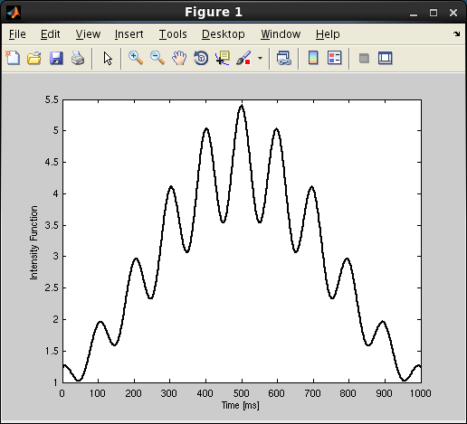

Figure 3b, c  
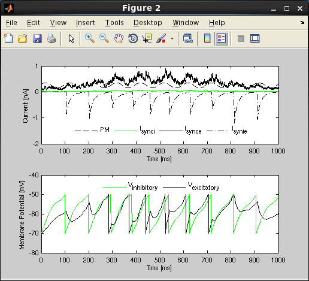

Figure 3d  
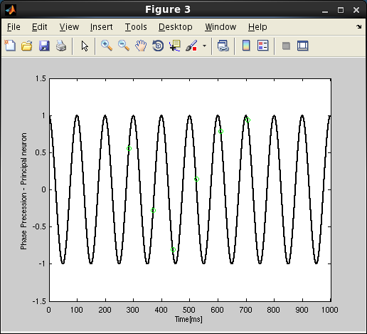

Figure 4a  
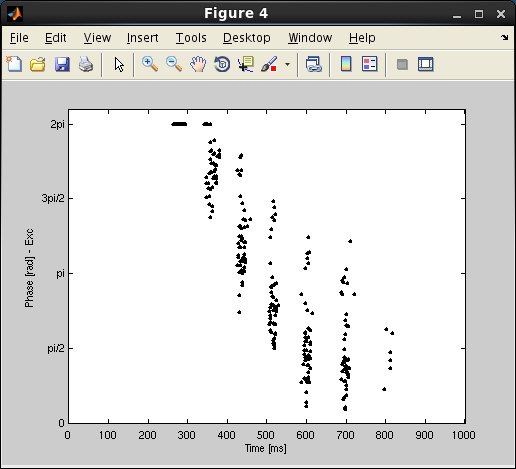

Figure 4b  
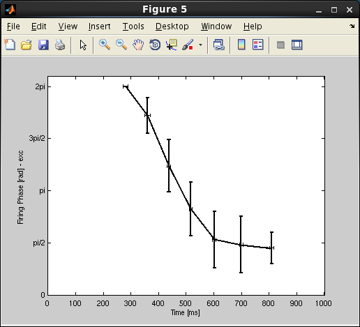

Figure 4c  
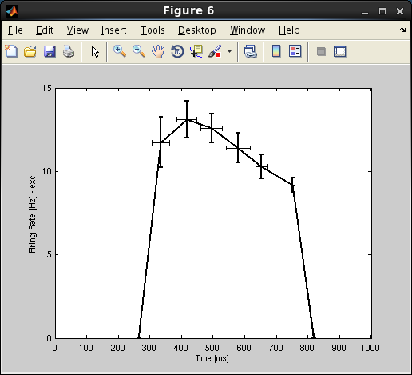

Figure 5a  
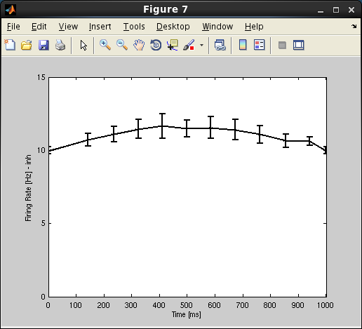

Figure 5b  
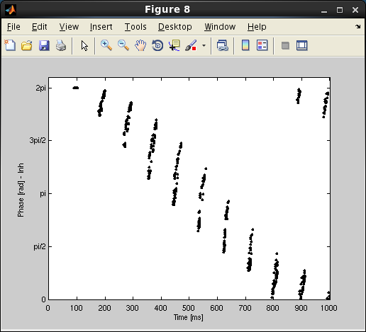

Figure 5c  
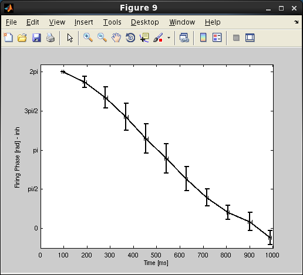

Figure 5d  
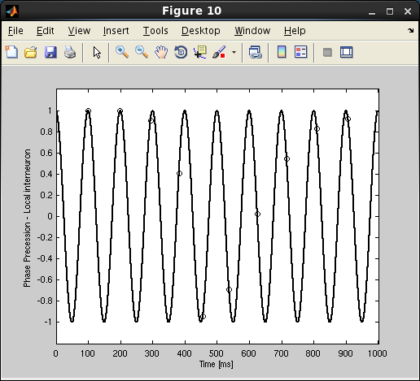

Figure 6  
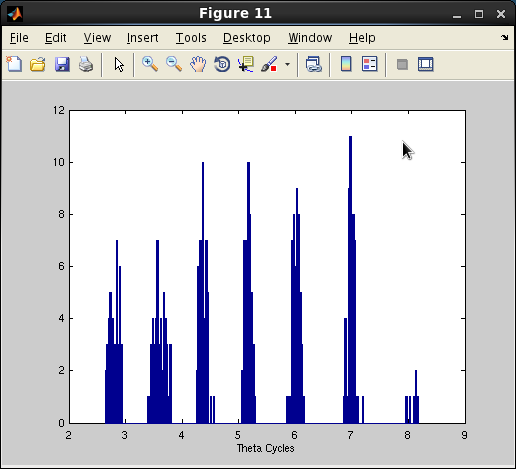

---

2025-06-20: Converted README to Markdown.